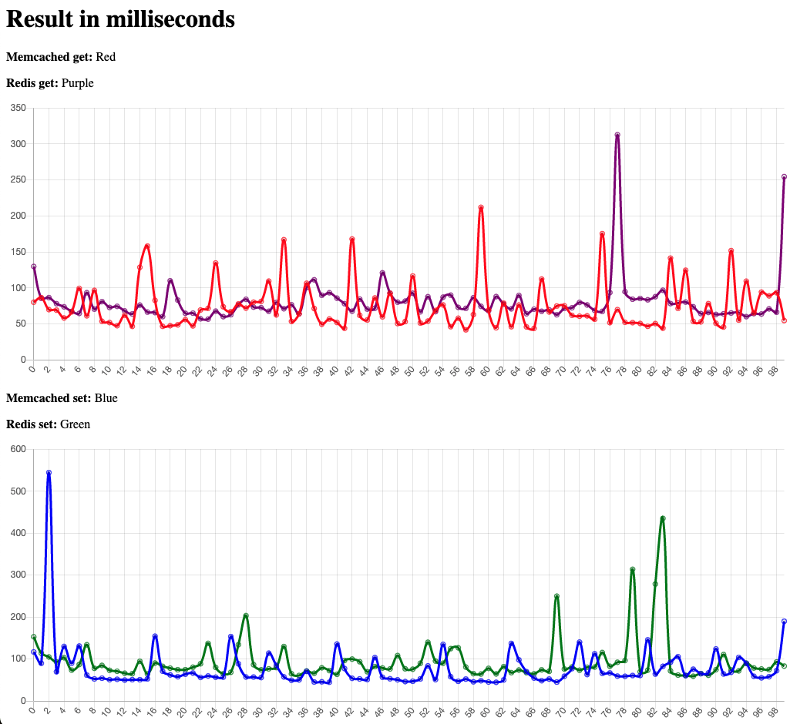

# Benchmark Memcached vs Redis

This repo is just look to "which is faster?". If you want to get a multi feature cache system, you must to choose Redis!

## Show results

show result
```shell
$ ./cli_bench --result
```

## Memcached

run bench to get without concurrency memcached
```shell
$ ./cli_bench --host localhost:11211 --requests 1000 --provider memcached --action get --delay 10
```

run bench to set without concurrency memcached
```shell
$ ./cli_bench --host localhost:11211 --requests 1000 --provider memcached --action set --delay 10
```

## Redis

run bench to get without concurrency redis
```shell
$ ./cli_bench --host localhost:6379 --requests 1000 --provider redis --action get --delay 10
```

run bench to set without concurrency redis
```shell
$ ./cli_bench --host localhost:6379 --requests 1000 --provider redis --action set --delay 10
```

You can add a concurrency to parallelize some requests, for example:
- You want to send 10 requests in the same time and the total of requests are 1000. So for get you can run:

## Concurrency

```shell
$ ./cli_bench --host localhost:6379 --requests 1000 --concurrency 10 --provider redis --action set --delay 10
```

Ps.: The delay will be executed after each 10 requests.


## Build

If you want to change something, you just have to run ``make build`` after it.

# Results

### Config

- ``RAM:`` 16 GB 2667 MHz DDR4
- ``CPU:`` 2,3 GHz 8-Core Intel Core i9
- ``Graphics:`` AMD Radeon Pro 5500M 4 GB and Intel UHD Graphics 630 1536 MB
- ``OS:`` MacOS Ventura Version 13.1

### Setup
``Total Requests``: 1000
``Concurrent Request``: 10
``Delay between bunch of requests``: 10ns

### Result
